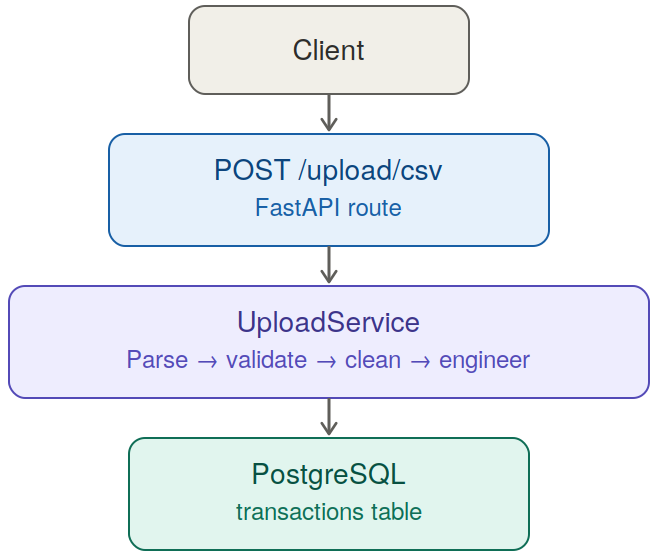

# NeuroBudget — AI Financial Copilot

An AI-powered personal finance backend that turns raw bank-statement CSVs into a queryable, multi-agent financial assistant — built with **FastAPI**, **LangGraph**, **Pinecone**, and **OpenRouter LLMs**.

<p align="center">
  
  
  
  
  
  
</p>


## Overview

NeuroBudget lets a user upload a bank-statement CSV and then **chat with their own financial data**. Under the hood, an incoming question is routed by a supervisor to one of four specialized LangGraph agents (Expense, Insight, Risk, Planning), which pull relevant transactions from a Pinecone vector index and generate a grounded answer using an OpenRouter-hosted LLM.

Core capabilities implemented in the backend today:

- **CSV ingestion pipeline** — parse, validate, clean, feature-engineer, and persist bank transactions to PostgreSQL.
- **Retrieval-Augmented Chat** — semantic search over transaction embeddings (Pinecone) feeding an LLM prompt.
- **Multi-agent routing** — a keyword-based supervisor dispatches each question to the right specialist agent.
- **Risk scoring** — flags large/anomalous transactions and computes a 0–100 risk score.
- **Goal & budget planning** — disposable income, 50/30/20 budget split, emergency fund sizing, and per-goal savings feasibility.

---

## How It Works

1. A user uploads a CSV of bank transactions via `POST /upload/csv`.
2. The backend validates, cleans, and enriches the data (weekday, quarter, transaction size, income/expense flow, etc.) and stores each row in PostgreSQL.
3. The user asks a question via `POST /chat` (e.g. *"How much did I spend on food?"*).
4. A **Supervisor** agent inspects the question's keywords and routes it to one of: **ExpenseAgent**, **InsightAgent**, **RiskAgent**, or **PlanningAgent**.
5. The chosen agent (for Expense/Insight/Risk) runs a **RAG pipeline**: embed the question → semantic search Pinecone for similar transactions → build a grounded prompt → call the LLM via OpenRouter. The **PlanningAgent** additionally computes a structured financial report directly from PostgreSQL (income, expenses, disposable income, goal feasibility) before prompting the LLM.
6. The final answer, along with the agent that handled it, is returned to the client.

---

## Architecture / Flowchart

**CSV upload pipeline** — client → API → ingestion service → database:



**Chat pipeline** — client question routed through the multi-agent workflow to a grounded LLM answer:

.png)

---

## Backend Deep Dive

### Backend Structure

```text
backend/
├── app.py                     # FastAPI app entrypoint (CORS, routers, /health)
├── config.py                  # legacy config (see core/config.py for active settings)
├── requirements.txt
├── Dockerfile
├── docker-compose.yml
│
├── core/
│   ├── config.py               # Pydantic Settings — env vars, computed DATABASE_URL
│   ├── constants.py             # categories, payment methods, agent list, prompts
│   └── logger.py                # loguru logger setup
│
├── api/                        # FastAPI routers
│   ├── router.py                # aggregates all routers into api_router
│   ├── upload.py                # POST /upload/csv  (active)
│   ├── chat.py                  # POST /chat         (active)
│   ├── health.py                # health check route
│   ├── insights.py              # placeholder (not yet implemented)
│   ├── risk.py                  # placeholder (not yet implemented)
│   ├── planning.py              # placeholder (not yet implemented)
│   ├── forcast.py                # placeholder (not yet implemented)
│   └── reports.py               # placeholder (not yet implemented)
│
├── agents/                     # LangGraph multi-agent system
│   ├── workflow.py               # builds & compiles the StateGraph
│   ├── supervisor.py             # keyword-based router
│   ├── expense_agent.py          # RAG-backed expense Q&A
│   ├── insight_agent.py          # RAG-backed insight/summary Q&A
│   ├── risk_agent.py             # risk scoring + RAG explanation
│   ├── planning_agent.py         # budget/goal math + RAG explanation
│   └── forecasting_agent.py      # placeholder (not yet implemented)
│
├── rag/                        # Retrieval-Augmented Generation
│   ├── pinecone_client.py        # Pinecone index init/connection
│   ├── embeddings.py             # sentence-transformers (BAAI/bge-small-en-v1.5)
│   ├── document_builder.py       # Transaction → text document + metadata
│   ├── vector_store.py           # upsert/delete/fetch vectors in Pinecone
│   ├── retriever.py               # semantic search (+ category/merchant/flow filters)
│   ├── prompt.py                  # system prompt + prompt/context builders
│   └── rag_pipeline.py            # retrieve → prompt → OpenRouter completion
│
├── service/
│   └── upload_service.py         # orchestrates the full CSV ingestion pipeline
│
├── tools/                      # data-processing utilities used by upload_service
│   ├── csv_parser.py              # reads & validates CSV file type
│   ├── validator.py               # schema/column/type/date validation
│   ├── data_cleaner.py            # dedup, trim whitespace, normalize
│   ├── feature_engineering.py     # derives weekday/month/quarter/flow/size features
│   └── pinecone_uploader.py       # placeholder (not yet implemented)
│
├── database/
│   ├── db.py                      # SQLAlchemy engine/session (PostgreSQL)
│   ├── models.py                  # Transaction, Goal, Forecast, Report, ChatHistory
│   ├── seed.py                    # create/drop/reset tables
│   └── crud/
│       ├── transaction_crud.py
│       ├── goal_crud.py
│       ├── forecast_crud.py
│       ├── report_crud.py
│       └── chat_crud.py
│
├── models/                     # Pydantic + TypedDict models
│   ├── state.py                   # GraphState (LangGraph shared state) + helpers
│   ├── chat_schema.py
│   ├── transaction_schema.py
│   ├── goal_schema.py
│   ├── forecast_schema.py
│   └── report_schema.py
│
├── schemas/
│   └── chat.py                    # ChatRequest / ChatResponse (used by /chat)
│
├── utils/
│   ├── logger.py
│   └── constants.py
│
└── uploads/
    ├── raw/                        # incoming CSVs land here
    ├── processed/
    └── archive/
```

### Request Lifecycle

**Upload flow** (`POST /upload/csv`, in `api/upload.py` → `service/upload_service.py`):

1. `CSVParser.read_csv` — loads the file into a pandas DataFrame, rejects non-CSV input.
2. `DataValidator.validate` — checks required columns, empty data, duplicates, valid amounts, valid transaction types (`Credit`/`Debit`), and parseable dates.
3. `DataCleaner.clean` — removes duplicate rows and trims whitespace from string columns.
4. `FeatureEngineering.engineer` — derives `transaction_month`, `month_number`, `day`, `weekday`, `quarter`, `year`, `is_weekend`, `flow` (Income/Expense), and `transaction_size`.
5. `save_transactions` — inserts each row as a `Transaction` row via `database.crud.transaction_crud.create_transaction`.
6. Returns a JSON summary: `status`, `rows_processed`, `rows_inserted`, `columns`.

**Chat flow** (`POST /chat`, in `api/chat.py`):

1. `models.state.create_state` builds the initial `GraphState` (question, session_id, empty agent outputs).
2. `agents.workflow.workflow.run(state)` invokes the compiled LangGraph graph, starting at the `Supervisor` node.
3. `Supervisor.route` lowercases the question and checks it against keyword lists (expense, insight, risk, planning) to pick the next agent — defaulting to `InsightAgent` if nothing matches.
4. The selected agent node executes and returns an updated `GraphState` containing `answer`, `current_agent`, and agent-specific output (`expenses`/`insights`/`risks`/`planning`).
5. The router returns a `ChatResponse` with `answer`, `current_agent`, and `session_id`.

### Multi-Agent System (LangGraph)

The workflow is a `StateGraph` (see `agents/workflow.py`) with a single entry point and no loops — each agent runs once per request and edges straight to `END`:

| Agent | Trigger Keywords (examples) | What it does |
|---|---|---|
| **ExpenseAgent** | expense, spent, shopping, merchant, food, travel, amazon, flipkart, swiggy, payment | Runs the RAG pipeline over transactions and returns a grounded answer plus retrieved documents. |
| **InsightAgent** | summary, insight, analysis, report, recommend, trend | Same RAG pipeline; default fallback agent when no other keyword matches. |
| **RiskAgent** | risk, overspending, overspend, anomaly, fraud, large, high spending | Computes average expense, flags transactions ≥ 2× average, derives a 0–100 risk score, generates rule-based recommendations, and also runs RAG for a narrative explanation. |
| **PlanningAgent** | goal, budget, save, saving, plan, planning, laptop, vacation, car, house, emergency | Computes total income/expense, disposable income, a 50/30/20 budget split, a recommended emergency fund (6× average monthly expense), per-goal monthly-savings requirements and feasibility, then asks the LLM to explain the report. |

The `SupervisorAgent.route()` method performs simple substring/keyword matching (no ML classifier) to decide routing — this keeps routing fast, deterministic, and easy to extend by adding new keywords.

### RAG Pipeline

Implemented in `rag/`:

- **Embeddings** (`embeddings.py`) — `sentence-transformers` model `BAAI/bge-small-en-v1.5` (384-dim, cosine similarity), loaded once as a singleton.
- **Vector store** (`pinecone_client.py`, `vector_store.py`) — Pinecone serverless index; created automatically if it doesn't exist. Supports single/bulk transaction upsert, delete, fetch, and stats.
- **Document builder** (`document_builder.py`) — converts each `Transaction` row into a structured text block (merchant, amount, category, city, flow, etc.) plus a metadata dict for filtering.
- **Retriever** (`retriever.py`) — embeds the query and performs a top-k similarity search against Pinecone, with optional filters by category, merchant, or income/expense flow.
- **Prompt manager** (`prompt.py`) — a strict system prompt instructing the LLM to answer only from retrieved transactions, never fabricate data, use ₹ for currency, and explicitly say when information isn't found.
- **Pipeline** (`rag_pipeline.py`) — orchestrates retrieve → build prompt → call OpenRouter (`chat.completions.create`, temperature 0.2, max 800 tokens) → return `{answer, retrieved_documents, sources}`.

### Data Ingestion Pipeline

`tools/` contains the individual, composable steps used by `UploadService`:

- `csv_parser.py` — file existence/extension checks, pandas read.
- `validator.py` — enforces required columns (`transaction_id`, `transaction_date`, `merchant`, `description`, `amount`, `transaction_type`, `category`, `payment_method`, `account_type`, `city`, `balance_after_transaction`), valid `Credit`/`Debit` types, and parseable dates.
- `data_cleaner.py` — duplicate removal and string trimming.
- `feature_engineering.py` — date-derived features (`weekday`, `quarter`, `is_weekend`, etc.) and transaction `flow`/`transaction_size` classification used later for risk and planning aggregates.

### Database Layer

PostgreSQL via SQLAlchemy (`database/db.py`, `database/models.py`). Tables:

| Table | Purpose |
|---|---|
| `transactions` | Every ingested bank transaction, with engineered date/flow/size features. |
| `goals` | Savings goals (`target_amount`, `current_amount`, `deadline_months`, `status`). |
| `forecasts` | Reserved for future expense-forecasting output (`predicted_expense`, `confidence_score`). |
| `reports` | Reserved for generated report JSON/PDF metadata. |
| `chat_history` | Reserved for persisting chat Q&A per `session_id`. |

`database/crud/` provides per-entity CRUD helpers (`transaction_crud.py`, `goal_crud.py`, `forecast_crud.py`, `report_crud.py`, `chat_crud.py`). `database/seed.py` exposes `create_tables()` to initialize the schema.

### API Reference

Only the routes below are currently wired into `api/router.py`. `insights.py`, `risk.py`, `planning.py`, `forcast.py`, and `reports.py` exist as empty placeholder files for future dedicated endpoints — that logic currently lives inside the LangGraph agents and is only reachable through `/chat`.

| Endpoint | Method | Description |
|---|---|---|
| `/` | GET | Welcome message, app name/version, docs link. |
| `/health` | GET | Basic health check (`{"status": "healthy"}`). |
| `/upload/csv` | POST | Upload a bank-statement CSV; runs the full ingestion pipeline and stores transactions in PostgreSQL. |
| `/chat` | POST | Ask a financial question; routed through the LangGraph multi-agent workflow. |
| `/docs` | GET | Swagger UI (auto-generated by FastAPI). |
| `/redoc` | GET | ReDoc UI (auto-generated by FastAPI). |

**Upload example**

```bash
curl -X POST http://localhost:8000/upload/csv \
  -F "file=@sample_transactions.csv"
```

**Chat example**

```bash
curl -X POST http://localhost:8000/chat \
  -H "Content-Type: application/json" \
  -d '{"question":"How much did I spend on food?","session_id":"user_1"}'
```

**Chat response shape**

```json
{
  "answer": "Based on your uploaded transactions, ...",
  "current_agent": "ExpenseAgent",
  "session_id": "user_1"
}
```

### Configuration / Environment Variables

Settings are loaded from a `.env` file via `core/config.py` (Pydantic `BaseSettings`). Create `backend/.env`:

```env
# FastAPI
DEBUG=True
HOST=0.0.0.0
PORT=8000

# PostgreSQL
POSTGRES_USER=your_user
POSTGRES_PASSWORD=your_password
POSTGRES_HOST=localhost
POSTGRES_PORT=5432
POSTGRES_DB=neurobudget

# OpenRouter
OPENROUTER_API_KEY=your_openrouter_key
OPENROUTER_MODEL=openai/gpt-4o-mini

# Pinecone
PINECONE_API_KEY=your_pinecone_key
PINECONE_INDEX=neurobudget-index
PINECONE_REGION=us-east-1

# Optional overrides
EMBEDDING_MODEL=BAAI/bge-small-en-v1.5
MAX_CHAT_HISTORY=10
MAX_UPLOAD_SIZE_MB=20
```

`DATABASE_URL` is computed automatically from the `POSTGRES_*` values — no need to set it directly.

### Running the Backend

```bash
# 1. Clone and enter the backend
git clone https://github.com/nirajg5/NeuroBudget.git
cd NeuroBudget/backend

# 2. Create a virtual environment
python -m venv venv
source venv/bin/activate      # Windows: venv\Scripts\activate

# 3. Install dependencies
pip install -r requirements.txt

# 4. Configure .env (see above)

# 5. Create database tables
python -c "from database.seed import create_tables; create_tables()"

# 6. Run the API
uvicorn app:app --reload
```

The API will be available at `http://localhost:8000`, with interactive docs at `http://localhost:8000/docs`.

### Running with Docker

```bash
cd backend
docker compose up --build
```

This builds the image from the provided `Dockerfile` (Python 3.12-slim) and starts the `neurobudget_backend` container on port `8000`, reading environment variables from `backend/.env`.

---

## Frontend (Structure Only)

The frontend is a **TanStack Start** (React + Vite + TypeScript) app styled with **Tailwind CSS** and **shadcn/ui** (Radix primitives). High-level structure only — see the backend sections above for implementation depth.

```text
frontend/
├── package.json
├── vite.config.ts
├── tsconfig.json
├── wrangler.jsonc            # Cloudflare deployment config
├── components.json           # shadcn/ui config
│
└── src/
    ├── router.tsx             # TanStack router setup
    ├── routeTree.gen.ts       # auto-generated route tree
    ├── server.ts / start.ts   # SSR entrypoints
    ├── styles.css
    │
    ├── routes/
    │   ├── __root.tsx          # root layout
    │   ├── index.tsx           # dashboard / landing route
    │   ├── chat.tsx            # AI chat interface
    │   ├── upload.tsx          # CSV upload page
    │   └── insights.tsx        # insights/analytics view
    │
    ├── components/
    │   ├── AppSidebar.tsx
    │   └── ui/                 # shadcn/ui component library
    │
    ├── hooks/
    │   └── use-mobile.tsx
    │
    └── lib/
        ├── utils.ts
        ├── error-capture.ts
        └── error-page.ts
```

---

## Tech Stack

| Layer | Technology |
|---|---|
| Backend API | FastAPI |
| Multi-Agent Orchestration | LangGraph |
| LLM Provider | OpenRouter |
| Embeddings | sentence-transformers (`BAAI/bge-small-en-v1.5`) |
| Vector Database | Pinecone (serverless) |
| Relational Database | PostgreSQL |
| ORM / Migrations | SQLAlchemy + Alembic |
| Validation | Pydantic / Pydantic Settings |
| Data Processing | Pandas, NumPy |
| Logging | Loguru |
| Containerization | Docker / Docker Compose |
| Frontend Framework | TanStack Start (React + Vite + TypeScript) |
| Frontend UI | Tailwind CSS, shadcn/ui, Radix UI |

---

## Project Status

- CSV upload & ingestion pipeline (parse → validate → clean → feature-engineer → persist)
- RAG-powered chat over transactions (Pinecone + OpenRouter)
- Supervisor-routed multi-agent workflow (Expense, Insight, Risk, Planning)
- Risk scoring and rule-based recommendations
- Budget planning (50/30/20 rule, emergency fund, goal feasibility)
- Dedicated REST endpoints for `/insights`, `/risk`, `/planning`, `/forecast`, `/reports` (currently placeholder files; functionality only reachable via `/chat`)
- Expense forecasting agent (`forecasting_agent.py` is a placeholder)
- Pinecone bulk-uploader tool (`pinecone_uploader.py` is a placeholder)
- Chat history persistence (`chat_history` table defined, not yet wired into `/chat`)

## Roadmap

- Authentication & multi-user support
- Expense forecasting (time-series model)
- Scheduled/automated financial reports
- Real-time spending notifications
- Mobile app integration

---
